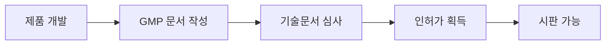
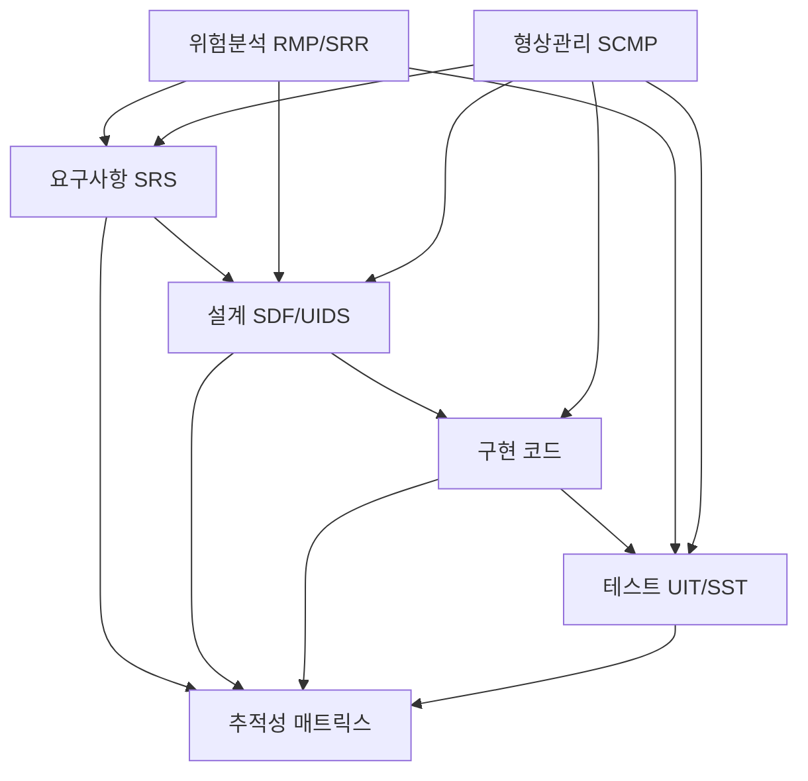

# 의료기기 소프트웨어 GMP 개념 가이드

디지털 치료제(DTx) 및 의료기기 소프트웨어 개발자를 위한 GMP 문서화 가이드

---

## 목차
1. [GMP란 무엇인가?](#1-gmp란-무엇인가)
2. [왜 GMP 문서를 작성해야 하는가?](#2-왜-gmp-문서를-작성해야-하는가)
3. [핵심 국제 표준](#3-핵심-국제-표준)
4. [GMP 문서 체계](#4-gmp-문서-체계)
5. [각 문서의 역할과 관계](#5-각-문서의-역할과-관계)
6. [소프트웨어 수명주기와 문서](#6-소프트웨어-수명주기와-문서)
7. [위험관리 프로세스](#7-위험관리-프로세스)
8. [모바일 앱 개발자 관점](#8-모바일-앱-개발자-관점)
9. [용어 정리](#9-용어-정리)

---

## 1. GMP란 무엇인가?

### 1.1 정의

**GMP (Good Manufacturing Practice)** = **우수 제조 관리 기준**

의료기기의 설계, 개발, 제조, 품질관리 전 과정에서 일정 수준 이상의 품질을 보장하기 위한 규정과 기준.

```
일반 소프트웨어 개발          vs          의료기기 소프트웨어 개발
─────────────────────                    ─────────────────────────
• 기능 동작하면 OK                        • 기능 + 안전성 + 추적성 필수
• 문서는 선택사항                         • 문서는 필수 (규제 요구)
• 버그는 패치로 해결                      • 버그는 환자 안전 위협
• 빠른 배포 우선                          • 검증된 배포 우선
```

### 1.2 소프트웨어 의료기기 (SaMD)

**Software as a Medical Device (SaMD)** = 하드웨어 없이 소프트웨어 자체가 의료기기인 것

```
┌─────────────────────────────────────────────────────────┐
│                    SaMD 예시                             │
├─────────────────────────────────────────────────────────┤
│ • 디지털 치료제 (DTx) - 질병 치료/관리 목적 앱          │
│ • AI 진단 보조 소프트웨어                               │
│ • 환자 모니터링 앱                                      │
│ • 임상 의사결정 지원 시스템                             │
│ • ABCare, Canmore 같은 환자 관리 앱                    │
└─────────────────────────────────────────────────────────┘
```

### 1.3 규제 기관

| 국가 | 규제 기관 | 관련 법규 |
|------|-----------|-----------|
| 한국 | 식품의약품안전처 (MFDS) | 의료기기법, KGMP |
| 미국 | FDA | 21 CFR Part 820 |
| 유럽 | EU MDR | MDR 2017/745 |
| 일본 | PMDA | 약기법 |

---

## 2. 왜 GMP 문서를 작성해야 하는가?

### 2.1 법적 요구사항

```
의료기기로 출시하려면 → 인허가 필요 → GMP 문서 필수
```

**식약처 인허가 과정:**


### 2.2 핵심 이유 4가지

#### (1) 환자 안전 보장
```
의료기기는 사람의 생명과 직결
→ 오류 발생 시 심각한 피해 가능
→ 체계적인 위험관리 필요
→ 문서화된 프로세스로 안전성 입증
```

#### (2) 품질의 일관성 유지
```
"문서화되지 않은 것은 존재하지 않는 것"

• 누가 개발해도 동일한 품질 수준 유지
• 담당자 변경 시에도 지식 전달 가능
• 반복 가능한 프로세스 확립
```

#### (3) 추적성 (Traceability) 확보
```
요구사항 ←→ 설계 ←→ 구현 ←→ 테스트

모든 단계가 연결되어 있어야 함
→ 문제 발생 시 원인 추적 가능
→ 변경 영향도 파악 가능
```

#### (4) 규제 준수 증명
```
심사관에게 증명해야 할 것:
✓ 개발 프로세스가 체계적이었다
✓ 위험을 분석하고 관리했다
✓ 충분한 테스트를 수행했다
✓ 품질관리 시스템이 있다
```

### 2.3 문서가 없으면?

| 상황 | 결과 |
|------|------|
| 인허가 심사 | 심사 탈락, 보완 요청 반복 |
| 시장 출시 후 문제 발생 | 원인 파악 불가, 리콜 대응 어려움 |
| 개발자 퇴사 | 유지보수 불가능 |
| 해외 진출 | 각국 규제 대응 불가 |

---

## 3. 핵심 국제 표준

### 3.1 표준 체계 개요

```
┌─────────────────────────────────────────────────────────────┐
│                    의료기기 소프트웨어 표준 체계              │
├─────────────────────────────────────────────────────────────┤
│                                                             │
│   ┌─────────────┐     ┌─────────────┐     ┌─────────────┐   │
│   │ ISO 13485   │     │ ISO 14971   │     │ IEC 62304   │   │
│   │ 품질경영    │     │ 위험관리    │     │ SW 수명주기 │   │
│   │ 시스템      │     │             │     │ 프로세스    │   │
│   └──────┬──────┘     └──────┬──────┘     └──────┬──────┘   │
│          │                   │                   │          │
│          └───────────────────┼───────────────────┘          │
│                              │                              │
│                    ┌─────────┴─────────┐                    │
│                    │   IEC 62366-1     │                    │
│                    │   사용성 공학     │                    │
│                    └───────────────────┘                    │
│                                                             │
└─────────────────────────────────────────────────────────────┘
```

### 3.2 각 표준의 역할

#### IEC 62304 - 의료기기 소프트웨어 수명주기 프로세스
```
무엇을: 소프트웨어 개발의 전체 과정을 정의
언제:   기획 → 요구사항 → 설계 → 구현 → 테스트 → 릴리즈 → 유지보수
핵심:   각 단계별 필요한 활동과 산출물 명시

소프트웨어 안전 등급:
┌─────────┬────────────────────────────────────────────────┐
│ Class A │ 상해 또는 건강 손상 가능성 없음                 │
│ Class B │ 중상해 가능성 없음 (경상해 가능)               │
│ Class C │ 사망 또는 중상해 가능 (가장 엄격한 요구사항)   │
└─────────┴────────────────────────────────────────────────┘
```

#### ISO 14971 - 의료기기 위험관리
```
무엇을: 제품과 관련된 위험을 체계적으로 관리
프로세스:
  1. 위험 분석 (Risk Analysis) - 위험 식별
  2. 위험 평가 (Risk Evaluation) - 허용 가능 여부 판단
  3. 위험 통제 (Risk Control) - 위험 감소 조치
  4. 잔여 위험 평가 - 조치 후 남은 위험 확인
  5. 생산 후 모니터링 - 출시 후 지속 관리
```

#### ISO 13485 - 의료기기 품질경영시스템
```
무엇을: 조직의 품질관리 체계 전반
포함:   문서관리, 기록관리, 교육훈련, 설계통제,
        공급업체관리, 생산관리, 부적합품 관리 등
```

#### IEC 62366-1 - 사용성 공학
```
무엇을: 사용자가 안전하게 사용할 수 있도록 설계
포함:   사용 시나리오, 사용 오류 분석, 사용성 테스트
중요:   많은 의료기기 사고가 사용 오류에서 발생
```

---

## 4. GMP 문서 체계

### 4.1 문서 구조 (Canmore 예시 기반)

```
제품표준서 (DMR - Device Master Record)
│
├── [첨부1] 소프트웨어 개발 계획서 (SDP - Software Development Plan)
│         → 개발 전체 계획, 일정, 조직, 프로세스
│
├── [첨부2] 소프트웨어 기능요구사항명세서 (SRS - Software Requirements Specification)
│         → 기능 요구사항 상세 정의
│
├── [첨부3] 사용자 인터페이스 설계 명세서 (UIDS - User Interface Design Specification)
│         → UI/UX 설계, 사용성 고려사항
│
├── [첨부4] 소프트웨어 상세설계파일 (SDF - Software Design File)
│         → 아키텍처, 모듈 설계, DB 설계
│
├── [첨부5] 소프트웨어 테스트 계획서 (STP - Software Test Plan)
│         → 테스트 전략, 환경, 일정
│
├── [첨부6] 소프트웨어 검증계획서 (SVP - Software Verification Plan)
│         → 검증 방법, 기준, 절차
│
├── [첨부7] Unit & Integration 검증 보고서 (UIT - Unit & Integration Test)
│         → 단위/통합 테스트 결과
│
├── [첨부8] System 검증 보고서 (SST - Software System Test)
│         → 시스템 테스트 결과, 스크린샷
│
├── [첨부9] 소프트웨어 릴리즈 절차서 (QP711)
│         → 배포 프로세스, 승인 절차
│
├── [첨부10] 소프트웨어 유지보수 절차서 (QP712)
│         → 유지보수 방법, 변경 관리
│
├── [첨부11] 소프트웨어 문제추적 절차서 (QP713)
│         → 버그/이슈 관리 프로세스
│
├── [첨부12] 위험관리계획서 (RMP - Risk Management Plan)
│         → 위험관리 프로세스, 기준
│
├── [첨부13] 위험관리보고서 (RMR - Risk Management Report)
│         → 위험관리 수행 결과
│
├── [첨부14] 소프트웨어 위험분석보고서 (SRR - Software Risk Report)
│         → SW 관점 위험분석
│
├── [첨부15] 소프트웨어 형상관리 계획서 (SCMP - Software Configuration Management Plan)
│         → 버전관리, 변경통제
│
├── 📁 사이버보안
│         → 보안 관련 문서
│
└── 의료기기 소프트웨어 적합성 확인보고서
          → 최종 적합성 확인
```

### 4.2 문서 코드 체계

```
ARDS-[문서유형]-[제품명]

예시:
ARDS-SDP-CANMORE  = 소프트웨어 개발 계획서
ARDS-SRS-CANMORE  = 소프트웨어 요구사항 명세서
ARDS-RMP-CANMORE  = 위험관리 계획서
ARDS-DMR-CANMORE  = 제품표준서 (Device Master Record)
```

### 4.3 문서 간 관계



---

## 5. 각 문서의 역할과 관계

### 5.1 개발 단계별 문서

| 단계 | 문서 | 핵심 질문 |
|------|------|-----------|
| 계획 | SDP (개발계획서) | "어떻게 개발할 것인가?" |
| 요구사항 | SRS (요구사항명세서) | "무엇을 만들 것인가?" |
| 설계 | SDF, UIDS | "어떤 구조로 만들 것인가?" |
| 구현 | 소스코드, SCMP | "어떻게 관리할 것인가?" |
| 검증 | STP, SVP, UIT, SST | "제대로 만들었는가?" |
| 릴리즈 | QP711 | "어떻게 배포할 것인가?" |
| 유지보수 | QP712, QP713 | "출시 후 어떻게 관리할 것인가?" |

### 5.2 위험관리 문서

```
┌─────────────────────────────────────────────────────────────┐
│                    위험관리 문서 체계                        │
├─────────────────────────────────────────────────────────────┤
│                                                             │
│   RMP (위험관리계획서)                                       │
│   └─ "위험을 어떻게 관리할 것인가?" - 프로세스, 기준 정의    │
│                                                             │
│   SRR (소프트웨어 위험분석보고서)                            │
│   └─ "어떤 위험이 있는가?" - 위험 식별, 분석                │
│                                                             │
│   RMR (위험관리보고서)                                       │
│   └─ "위험을 어떻게 통제했는가?" - 통제 조치, 잔여 위험     │
│                                                             │
└─────────────────────────────────────────────────────────────┘
```

### 5.3 추적성 (Traceability)

```
요구사항 REQ-001 "사용자는 통증 기록을 입력할 수 있다"
    │
    ├── 설계: SDF-003 통증 기록 모듈
    │
    ├── 구현: PainRecordScreen.tsx
    │
    ├── 테스트: TC-015 통증 기록 입력 테스트
    │
    └── 위험: RISK-007 잘못된 통증 기록으로 인한 오진단

모든 요구사항이 설계 → 구현 → 테스트로 연결되어야 함
```

---

## 6. 소프트웨어 수명주기와 문서

### 6.1 IEC 62304 수명주기 모델

```
┌─────────────────────────────────────────────────────────────┐
│                 소프트웨어 수명주기 (IEC 62304)              │
├─────────────────────────────────────────────────────────────┤
│                                                             │
│  ┌──────────┐    ┌──────────┐    ┌──────────┐              │
│  │ 개발     │    │ 유지보수 │    │ 폐기     │              │
│  │ 프로세스 │───→│ 프로세스 │───→│          │              │
│  └──────────┘    └──────────┘    └──────────┘              │
│       │                                                     │
│       ▼                                                     │
│  ┌──────────────────────────────────────────────┐          │
│  │ 개발 프로세스 상세                            │          │
│  │                                              │          │
│  │  요구사항 → 설계 → 구현 → 검증 → 릴리즈      │          │
│  │     ↑                              │         │          │
│  │     └──────── 위험관리 ────────────┘         │          │
│  └──────────────────────────────────────────────┘          │
│                                                             │
└─────────────────────────────────────────────────────────────┘
```

### 6.2 단계별 활동과 산출물

| 단계 | 주요 활동 | 산출물 |
|------|-----------|--------|
| **개발 계획** | 프로젝트 계획 수립, 조직 구성 | SDP |
| **요구사항 분석** | 기능/비기능 요구사항 정의 | SRS |
| **아키텍처 설계** | 시스템 구조 설계 | SDF |
| **상세 설계** | 모듈/인터페이스 설계 | SDF, UIDS |
| **구현** | 코딩, 코드리뷰 | 소스코드 |
| **단위 검증** | 단위 테스트 | UIT |
| **통합 검증** | 통합 테스트 | UIT |
| **시스템 검증** | 시스템 테스트 | SST |
| **릴리즈** | 배포 준비, 승인 | 릴리즈 노트 |

---

## 7. 위험관리 프로세스

### 7.1 위험관리가 중요한 이유

```
의료기기 소프트웨어의 오류 = 환자에게 직접적 위해 가능

예시:
• 잘못된 복약 알림 → 과다/과소 복용
• 통증 기록 오류 → 잘못된 치료 결정
• 데이터 손실 → 치료 연속성 단절
• 앱 크래시 → 응급 상황 대응 실패
```

### 7.2 위험관리 프로세스 흐름

```
┌─────────────────────────────────────────────────────────────┐
│                    위험관리 프로세스                         │
├─────────────────────────────────────────────────────────────┤
│                                                             │
│   1. 위험 분석 (Risk Analysis)                              │
│   ┌─────────────────────────────────────────────┐          │
│   │ • 의도한 사용 및 오용 식별                   │          │
│   │ • 위해 요인 (Hazard) 식별                   │          │
│   │ • 위해 상황 (Hazardous Situation) 식별      │          │
│   │ • 위험 산정 (발생가능성 × 심각도)           │          │
│   └─────────────────────────────────────────────┘          │
│                         │                                   │
│                         ▼                                   │
│   2. 위험 평가 (Risk Evaluation)                            │
│   ┌─────────────────────────────────────────────┐          │
│   │ • 위험 허용 기준과 비교                      │          │
│   │ • 허용 가능/불가능 판정                      │          │
│   └─────────────────────────────────────────────┘          │
│                         │                                   │
│            ┌────────────┴────────────┐                     │
│            │                         │                     │
│       허용 가능               허용 불가능                   │
│            │                         │                     │
│            ▼                         ▼                     │
│   3. 위험 통제 (Risk Control)                               │
│   ┌─────────────────────────────────────────────┐          │
│   │ 우선순위:                                    │          │
│   │ 1) 설계로 제거 (Inherent Safety)            │          │
│   │ 2) 보호 장치 추가 (Protective Measures)     │          │
│   │ 3) 사용자 정보 제공 (Information)           │          │
│   └─────────────────────────────────────────────┘          │
│                         │                                   │
│                         ▼                                   │
│   4. 잔여 위험 평가                                         │
│   ┌─────────────────────────────────────────────┐          │
│   │ • 통제 후 남은 위험 평가                     │          │
│   │ • 이득-위험 분석 (Benefit-Risk)             │          │
│   └─────────────────────────────────────────────┘          │
│                                                             │
└─────────────────────────────────────────────────────────────┘
```

### 7.3 위험 산정 매트릭스

```
              심각도 (Severity)
         무시  경미  심각  위독  치명
        ┌────┬────┬────┬────┬────┐
자   5  │  5 │ 10 │ 15 │ 20 │ 25 │ 빈번
주   4  │  4 │  8 │ 12 │ 16 │ 20 │ 가끔
발   3  │  3 │  6 │  9 │ 12 │ 15 │ 이따금
생   2  │  2 │  4 │  6 │  8 │ 10 │ 드문
     1  │  1 │  2 │  3 │  4 │  5 │ 거의없음
        └────┴────┴────┴────┴────┘

■ 1~5: 허용 가능 (녹색)
■ 6~25: 허용 불가능 → 위험 통제 필요 (적색)
```

---

## 8. 모바일 앱 개발자 관점

### 8.1 일반 앱 개발 vs 의료기기 앱 개발

| 구분 | 일반 앱 | 의료기기 앱 |
|------|---------|-------------|
| 요구사항 | 기획서, 유저 스토리 | SRS (추적 가능한 형식) |
| 설계 | 자유로운 문서화 | SDF, UIDS (표준 양식) |
| 코딩 | 자유로운 스타일 | 코딩 표준, SOUP 관리 |
| 테스트 | 기능 동작 확인 | 문서화된 테스트 케이스, 증적 |
| 배포 | CI/CD 자동 배포 | 승인 프로세스 필요 |
| 버그 수정 | 즉시 패치 | 변경 통제 프로세스 |

### 8.2 개발자가 신경 써야 할 것들

#### SOUP 관리 (Software of Unknown Provenance)
```
SOUP = 출처 불명 소프트웨어 = 외부 라이브러리, 오픈소스

관리해야 할 항목:
• 라이브러리 이름, 버전
• 라이센스
• 알려진 취약점 (CVE)
• 업데이트 이력

예: React Native, Axios, Firebase SDK 등 모든 의존성
```

#### 코드 추적성
```
// 요구사항 ID를 코드에 연결
// REQ-023: 통증 기록 입력 기능
function PainRecordInput() {
  // ...
}
```

#### 변경 관리
```
모든 코드 변경은:
1. 변경 사유 문서화
2. 영향 분석
3. 위험 분석 업데이트 검토
4. 테스트 및 검증
5. 승인 후 반영
```

### 8.3 프론트엔드 개발자가 작성하는 문서

```
주로 관여하는 문서:
├── SRS - 기능 요구사항 정의 (참여)
├── UIDS - UI/UX 설계 문서 (주도)
├── SDF - 프론트엔드 아키텍처 (참여)
├── UIT - 단위 테스트 결과 (주도)
├── SST - 시스템 테스트 (참여)
└── SCMP - 형상관리 (참여)
```

---

## 9. 용어 정리

### 9.1 주요 약어

| 약어 | 영문 | 한글 | 비고 |
|------|------|------|------|
| GMP | Good Manufacturing Practice | 우수 제조 관리 기준 | |
| SaMD | Software as a Medical Device | 의료기기로서의 소프트웨어 | |
| DTx | Digital Therapeutics | 디지털 치료제 | |
| DMR | Device Master Record | 기기 주요 기록 | |
| DHF | Design History File | 설계 이력 파일 | |
| SDP | Software Development Plan | 소프트웨어 개발 계획서 | |
| **SRS** | **Software Requirements Specification** | **소프트웨어 요구사항 명세서** | "무엇을 만들 것인가" 정의 |
| **SDS** | **Software Design Specification** | **소프트웨어 설계 명세서** | "어떻게 만들 것인가" 정의, 일부 조직에서 사용 |
| **SDF** | **Software Design File** | **소프트웨어 설계 파일** | SDS와 동일 역할, ARDS/Canmore에서 사용하는 명칭 |
| **SAD** | **Software Architecture Document** | **소프트웨어 아키텍처 문서** | 시스템 구조 정의, 일부 조직에서 사용 |
| UIDS | User Interface Design Specification | 사용자 인터페이스 설계 명세서 | |
| STP | Software Test Plan | 소프트웨어 테스트 계획서 | |
| SVP | Software Verification Plan | 소프트웨어 검증 계획서 | |
| UIT | Unit & Integration Test | 단위 및 통합 테스트 | |
| SST | Software System Test | 소프트웨어 시스템 테스트 | |
| RMP | Risk Management Plan | 위험관리 계획서 | |
| RMR | Risk Management Report | 위험관리 보고서 | |
| SRR | Software Risk Report | 소프트웨어 위험 보고서 | |
| SCMP | Software Configuration Management Plan | 소프트웨어 형상관리 계획서 | |
| SOUP | Software of Unknown Provenance | 출처 불명 소프트웨어 | 외부 라이브러리, 오픈소스 |
| OTS | Off-The-Shelf | 상용 소프트웨어 | |
| V&V | Verification & Validation | 검증 및 유효성 확인 | |
| RA | Risk Analysis | 위험 분석 | |
| QA | Quality Assurance | 품질 보증 | |
| FMEA | Failure Mode and Effects Analysis | 고장 모드 영향 분석 | 위험분석 기법 |
| FTA | Fault Tree Analysis | 결함 트리 분석 | 위험분석 기법 |

### 9.2 혼동하기 쉬운 약어 비교

```
┌─────────────────────────────────────────────────────────────────┐
│                    설계 문서 약어 비교                           │
├─────────────────────────────────────────────────────────────────┤
│                                                                 │
│  SRS (Requirements)          SDS/SDF (Design)                  │
│  ─────────────────           ────────────────                  │
│  • "무엇을" 정의              • "어떻게" 정의                   │
│  • 기능 요구사항              • 아키텍처, 모듈 설계              │
│  • 비기능 요구사항            • 인터페이스 정의                  │
│  • 사용자 시나리오            • 데이터베이스 설계                │
│                                                                 │
│  ⚠️ 주의: SDS와 SDF는 같은 역할, 조직마다 다른 명칭 사용        │
│                                                                 │
│  Canmore/ARDS: SRS + SDF                                       │
│  일반적:       SRS + SDS                                       │
│                                                                 │
└─────────────────────────────────────────────────────────────────┘
```

```
┌─────────────────────────────────────────────────────────────────┐
│                    테스트 문서 약어 비교                         │
├─────────────────────────────────────────────────────────────────┤
│                                                                 │
│  STP (Test Plan)             SVP (Verification Plan)           │
│  ───────────────             ──────────────────────            │
│  • 테스트 전략                • 검증 방법론                      │
│  • 테스트 범위                • 검증 기준                        │
│  • 테스트 환경                • 검증 절차                        │
│                                                                 │
│  UIT (Unit/Integration)      SST (System Test)                 │
│  ──────────────────          ─────────────────                 │
│  • 단위 테스트 결과           • 시스템 전체 테스트 결과          │
│  • 통합 테스트 결과           • E2E 테스트 포함                  │
│  • 코드 수준 검증             • 사용자 시나리오 검증             │
│                                                                 │
└─────────────────────────────────────────────────────────────────┘
```

### 9.2 위험관리 용어

| 용어 | 정의 |
|------|------|
| 위해 (Harm) | 사람의 건강에 대한 상해나 손상 |
| 위해 요인 (Hazard) | 위해의 잠재적 원인 |
| 위해 상황 (Hazardous Situation) | 위해 요인에 노출되는 상태 |
| 위험 (Risk) | 발생 가능성 × 심각도 |
| 잔여 위험 (Residual Risk) | 통제 후 남은 위험 |

---

## 참고 자료

### 규격 문서
- IEC 62304:2006+A1:2015 - Medical device software - Software life-cycle processes
- ISO 14971:2019 - Application of risk management to medical devices
- ISO 13485:2016 - Quality management systems for medical devices
- IEC 62366-1:2015+A1:2020 - Application of usability engineering

### 참고 링크
- [식품의약품안전처](https://www.mfds.go.kr)
- [의료기기정보포털](https://emedi.mfds.go.kr)
- [FDA Software as Medical Device](https://www.fda.gov/medical-devices/digital-health-center-excellence/software-medical-device-samd)

---

*작성일: 2025-12-15*
*대상 독자: 의료기기 소프트웨어 (모바일 앱) 개발자*
*참고 문서: Canmore GMP 문서 세트*
